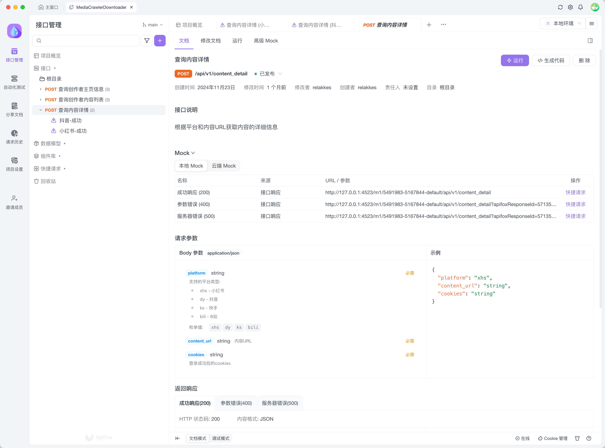

# MediaCrawlerProDownload 自媒体平台下载器Server端

## 简介

一个基于Python + Httpx + Tornado 的服务端，用于获取创作者的公开数据并清洗成指定格式返回给UI客户端

## 安装
> 依赖：
> 1、安装前需要启动签名服务：https://github.com/MediaCrawlerPro/MediaCrawlerPro-SignSrv
> 2、Python版本大于3.8：https://www.python.org/downloads/

```bash

# 创建虚拟环境
python -m venv venv

# 激活虚拟环境（mac/linux）
source venv/bin/activate 

# 激活虚拟环境（windows）
# venv\Scripts\activate

# 安装依赖
pip install -r requirements.txt
```

## 启动

```bash
python app.py
```

## API调试

项目docs下有swagger文档，可以导入到 `apifox`或者 `postman` 进行调试



## 免责声明
>
> 请注意，本项目仅针对 **MediaCrawlerPro项目成员** 学习使用!!!，禁止用于任何商业用途。也严格禁止分发或者打包该软件，否则造成的一切法律后果自行承担，并且一经发现，我会追究相关的责任。
>
本项目仅供学习和研究使用，禁止用于商业用途。使用本软件产生的任何法律责任由使用者自行承担。


## 感谢

- [Httpx](https://github.com/encode/httpx) - 提供了优秀的 HTTP 库
- [Tornado](https://github.com/tornadoweb/tornado) - 提供了优秀的 Web 框架

## License

[非商业学习使用许可证 1.1](LICENSE)
