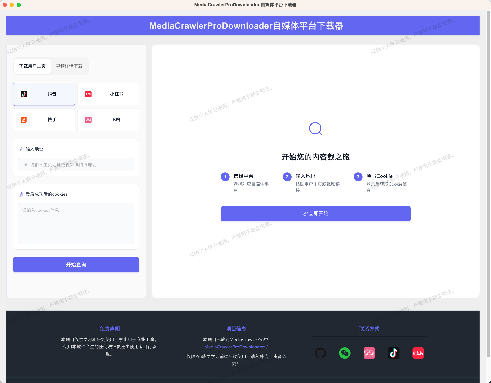

# MediaCrawlerProDownloader 自媒体视频下载器

一个前后端全栈项目，非常适合拿来学习和练手，包含前端 + 后端 + 爬虫的内容。

### 前端技术栈

- Electron
- Vue
- TypeScript
- Vite
- Element Plus 

### 后端技术栈

- Python
- httpx
- pydantic
- Tornado

## 界面截图




## 项目运行

### 克隆项目

```bash
git clone git@github.com:MediaCrawlerPro/MediaCrawlerPro-Downloader.git
```

### 前端部分

#### 安装依赖
> 依赖nodejs，nodejs的版本大于等于16
> 
> 安装nodejs：https://nodejs.org/en/download/
> 
> npm 安装包的过程中可能比较慢，可以使用国内阿里云的镜像源：npm config set registry https://npm.aliyun.com

```bash
cd DownloadUI
npm install
```

#### 启动前端项目
```bash
npm run dev
```

## 后端部分

### 安装依赖
> 依赖：
> 1、安装前需要启动MediaCrawlerPro的签名服务：https://github.com/MediaCrawlerPro/MediaCrawlerPro-SignSrv
>
> 2、Python版本大于3.8：https://www.python.org/downloads/
>

```bash
cd DownloadServer

# 创建虚拟环境
python -m venv venv

# 激活虚拟环境（mac/linux）
source venv/bin/activate
# 激活虚拟环境（windows）
# venv\Scripts\activate

# 安装依赖
pip install -r requirements.txt
```

### 启动后端服务

```bash
python app.py
```

## 项目目录结构

[项目目录结构](project_tree.md)

## 免责声明

> 请注意，本项目仅针对 **MediaCrawlerPro项目成员** 学习使用!!!，禁止用于任何商业用途。也严格禁止分发或者打包该软件，否则造成的一切法律后果自行承担，并且一经发现，我会追究相关的责任。

本项目仅供学习和研究使用，禁止用于商业用途。使用本软件产生的任何法律责任由使用者自行承担。


## License

[非商业学习使用许可证 1.1](LICENSE)